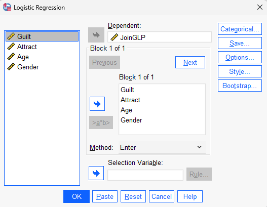
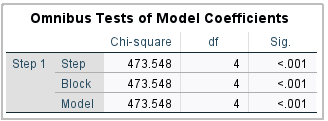
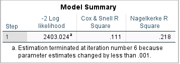
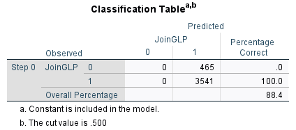
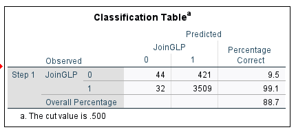
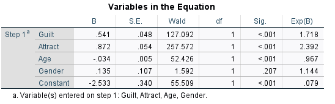

# Logistic Regression {#sec-lab8}
Data: HotelGLP_Logistic.sav (available on Moodle)

## Learning objectives
The aim of this lab is to help you use SPSS to conduct logistic regression analysis, which is useful when the outcome variable has only two possible values.
At the end of this lab, we hope that you will be able to

- Understand when logistic regression should be used instead of linear regression
- Conduct a binary logistic regression in SPSS
- Interpret logistic regression outputs
- Interpret odds ratios
- Evaluate model fit
- Assess the predictive usefulness of a logistic regression model

::: callout-important
Many marketing decisions involve predicting whether something will happen or not. A customer either buys or does not buy. A customer either joins a loyalty programme or declines. Logistic regression is one of the most widely used analytical tools for answering such questions.
:::

## Why Logistic Regression?
Suppose a hotel recently launched a Green Loyalty Programme (GLP). The hotel manager wants to understand which consumers are likely to join the programme. Unlike the previous workshop, the dependent variable is no longer measured on a scale from 1 to 7. Instead:

- Join GLP = 1
- Do Not Join GLP = 0

Because the dependent variable is binary, ordinary linear regression is no longer appropriate.
The hotel manager collected survey data measuring:

- Anticipated guilt if not joining the programme
- Perceived attractiveness of the service robot
- Age
- Gender

The objective is to predict whether a consumer joins the programme.
The relationship can be expressed as:

JoinGLP ~ Guilt + Attract + Age + Gender + error


Unlike linear regression, logistic regression predicts the probability that a customer belongs to one of two groups.
For example:

| Probability | Predicted Outcome |
|-------------|-------------------|
| 0.90        | Join GLP          |
| 0.75        | Join GLP          |
| 0.60        | Join GLP          |
| 0.40        | Do Not Join       |
| 0.15        | Do Not Join       |

A probability greater than 0.50 is typically classified as a "Join".

## The Logistic Regression Model
Linear regression predicts a score:

\begin{equation}

Y=\beta_0 + \beta_1X_1 + \beta_2X_2 + \beta_3X_3 ...

\end{equation}

Logistic regression predicts the log-odds of an event occurring:

\begin{equation} \ln\left(\frac{p}{1-p}\right)=\beta_0+\beta_1X_1+\beta_2X_2+\beta_3X_3+\beta_4X_4

\end{equation}

where:

* p = probability of joining the GLP
* $X_1$ = Guilt
* $X_2$ = Attractiveness
* $X_3$ = Age
* $X_4$ = Gender

Fortunately, SPSS performs all calculations automatically.
Our main objective is interpretation.

::: callout-important
The coefficients from logistic regression are not interpreted in the same way as ordinary regression coefficients.
Instead, we typically interpret the $Exp(\beta)$ values, which are known as **odds ratios**. $Exp(\beta)$ reads as exponential $\beta$, i.e., $Exp(\beta) = e^{\beta}$, where *e* is the base of the natural logarithm, approximately equal to 2.718.
:::

```{r, echo=FALSE, eval = FALSE }
library(haven)
set.seed(123)
n <- 4006
Guilt   <- pmin(pmax(rnorm(n,4.2,1.2),1),7)
Attract <- pmin(pmax(rnorm(n,4.5,1.1),1),7)
Age     <- pmin(pmax(round(rnorm(n,35,12)),18),75)
Gender  <- rbinom(n,1,.5)
lp <- -2.5 + 0.55* Guilt +
       0.80*Attract - 
       0.03*Age +
       0.12*Gender

p <- exp(lp)/(1+exp(lp))
JoinGLP <- rbinom(n,1,p)
dat <- data.frame(JoinGLP,Guilt,Attract,Age,Gender)

write_sav(dat,"C:/Users/daryanto/OneDrive - Lancaster University/My Modules/MKTG402/2025_26/HotelGLP_Logistic.sav")

```


## Conducting Logistic Regression in SPSS

Open HotelGLP_Logistic.sav

Click:

Analyze → Regression → Binary Logistic

Move:

* JoinGLP into the Dependent box

* Guilt, Attract, Age, Gender into Covariates

Click **OK**


{fig-align="center" width="70%"}


SPSS produces several output tables.

The most important are:

1. Omnibus Tests of Model Coefficients

2. Model Summary

3. Classification Table

4. Variables in the Equation


## Omnibus Tests of Model Coefficients
### Is the model useful?

{fig-align="center" width="70%"}

The Omnibus Tests of Model Coefficients table evaluates whether the set of predictors collectively improves prediction of the dependent variable compared with a model containing no predictors.

The null hypothesis is:

\begin{equation}
H_0:\beta_{Guilt}=\beta_{Attract}=\beta_{Age}=\beta_{Gender}=0
\end{equation}

In other words, none of the predictors help explain consumers' decision to join the green loyalty programme.

The alternative hypothesis is:

\begin{equation}
H_1:\text{At least one predictor has a non-zero effect.}
\end{equation}

The p-value is less than .001. Therefore, we reject the null hypothesis and conclude that the model is statistically significant.

This means that the set of predictors (`Guilt`, `Attract`, `Age`, and `Gender`) collectively improves our ability to predict whether consumers join the green loyalty programme.

::: callout-important
The logistic regression model is meaningful, $\chi^2(4) = 473.548, \, p < .001$.

Therefore, we can proceed to examine the remaining output tables to determine which variables significantly influence consumers' decision to join the green loyalty programme.
:::

### Reporting the Result

A typical write-up would be:

> The Omnibus Test of Model Coefficients was significant, $\chi^2(4) = 473.548, \, p < .001$, indicating that the set of predictors significantly improved prediction of consumers' decision to join the green loyalty programme compared with a model containing no predictors.


## Model Summary

How well does the model fit?

{fig-align="center" width="70%"}
The Model Summary table provides information about how well the logistic regression model fits the data.

The most commonly reported statistic is the $\text{Nagelkerke } R^2$.

In this example, $\text{Nagelkerke } R^2 = 0.218$.

This indicates that the predictors (`Guilt`, `Attract`, `Age`, and `Gender`) explain approximately **21.8%** of the variation in consumers' decisions to join the green loyalty programme.

This value suggests that the model has a moderate ability to explain consumers’ joining behaviour. In other words, the predictors help explain why some consumers join the programme and others do not, although additional factors not included in the model also influence joining decisions.


::: callout-important
Unlike multiple regression, logistic regression does not produce a traditional $R^2$. Instead, SPSS reports several  $\text{Pseudo-} R^2$ measures, including Cox & Snell $R^2$ and Nagelkerke $R^2$.

Among the two measures, $\text{Nagelkerke } R^2$ is generally preferred because its maximum value is 1, making it easier to interpret.
:::

::: callout-warning
$\text{Pseudo-} R^2$ values are generally lower than the $R^2$ values obtained from multiple regression.

Therefore, a Nagelkerke $R^2$ of 0.218 should not be interpreted as a weak model. In consumer and marketing research, values in this range are often considered meaningful.
:::

### Reporting the Result

A typical write-up would be:

> The logistic regression model explained approximately 21.8% of the variation in consumers' decision to join the green loyalty programme, as indicated by the Nagelkerke $\text{Nagelkerke } R^2$ value of 0.218.


# Classification Table

How accurate is the model?

{fig-align="center" width="70%"}


The Classification Table shows how accurately the model classifies consumers into the two categories of the dependent variable:

- `JoinGLP = 0` (Did Not Join)
- `JoinGLP = 1` (Joined)

The output shown above is for **Step 0**, which is the **baseline model** containing only the constant and no predictors.

| Observed | Predicted 0 | Predicted 1 | % Correct |
|----------|------------:|------------:|-----------:|
| JoinGLP = 0 | 0 | 465 | 0.0% |
| JoinGLP = 1 | 0 | 3541 | 100.0% |
| **Overall Percentage** | | | **88.4%** |

Notice that the model predicts **every respondent** as belonging to category 1 (Join GLP). Consequently:

- None of the non-joiners are classified correctly.
- All joiners are classified correctly.
- Overall accuracy is 88.4%.

This may appear to be an excellent result. However, it is actually not very impressive because the model has not yet used any predictors.

The reason is that most respondents in the sample joined the programme:

$$
\frac{3541}{3541+465}=0.884
$$

or **88.4%**.

Therefore, a model that simply predicts that everyone joins the programme would already achieve an accuracy rate of 88.4%.

::: callout-warning
Do not interpret the Step 0 classification accuracy as evidence of a good model.

The Step 0 model contains no predictors and merely classifies every respondent into the largest group.
:::

### Why Is This Table Useful?

The Step 0 classification table provides a **baseline accuracy rate** against which the final logistic regression model can be compared.

In this study:

- Baseline accuracy = **88.4%**
- Final model accuracy = **88.7%** (we will discuss now)

This comparison allows us to evaluate whether the predictors meaningfully improve prediction beyond simply classifying everyone into the largest group.

Now, let us look at the final classification table where you will see the final model accuracy of **88.7%**.

{fig-align="center" width="70%"}


The final classification table indicates that:

- Of the 465 consumers who did **not** join the programme, only 44 were correctly classified.

- Of the 3,541 consumers who **joined** the programme, 3,509 were correctly classified.

- The model correctly classified **88.7%** of all consumers.

At first glance, an accuracy rate of 88.7% appears impressive. However, we must compare this result with the **baseline model** (Step 0).

Recall that the Step 0 model achieved an accuracy rate of **88.4%** simply by classifying everyone as a joiner.

The logistic regression model improves the classification accuracy only slightly:

$$
88.7\% - 88.4\% = 0.3\%
$$

Thus, although the model is statistically significant, its overall classification accuracy is only marginally better than the baseline model.

### Sensitivity and Specificity

The classification table also provides insight into which group is predicted well.

The model correctly identifies:

- **99.1%** of consumers who joined the programme (high sensitivity).

- Only **9.5%** of consumers who did not join the programme (low specificity).

This indicates that the model is very good at identifying consumers who join the programme but performs poorly at identifying consumers who do not join.

::: callout-important
The logistic regression model correctly classified 88.7% of consumers.

However, this represents only a small improvement over the baseline accuracy of 88.4%. The model is highly accurate in identifying consumers who joined the programme (99.1%) but performs poorly in identifying consumers who did not join (9.5%).
:::

::: callout-warning
When one outcome category is much larger than the other, overall classification accuracy can be misleading.

In this dataset, 88.4% of respondents joined the programme. Therefore, a model can achieve high accuracy simply by predicting that everyone joins.

Always examine the percentage correctly classified for each category, not just the overall percentage.
:::

### Reporting the Result

A typical write-up would be:

> The logistic regression model correctly classified 88.7% of respondents. The model correctly identified 99.1% of consumers who joined the green loyalty programme but only 9.5% of consumers who did not join. Compared with the baseline classification accuracy of 88.4%, the model provided only a modest improvement in predictive accuracy.


## Variables in the Equation

Which variables matter?

{fig-align="center" width="70%"}

Example output:


@@@@@@@@@@


VariableBSig.Exp(B)Guilt.55.0011.73Attract.80.0002.23Age-.03.0200.97Gender.12.4201.13
We interpret significance first.
Step 1: Statistical Significance
Variables are significant when:
Plain Text1p < .05Show more lines
Therefore:
✅ Guilt significant
✅ Attract significant
✅ Age significant
❌ Gender not significant

Step 2: Interpret Odds Ratios
The Exp(B) column reports the odds ratio.
Example 1: Guilt
Plain Text1Exp(B) = 1.73Show more lines
For every one-unit increase in Guilt, the odds of joining the GLP increase by 73%.

Example 2: Attractiveness
Plain Text1Exp(B) = 2.23Show more lines
For every one-unit increase in Attractiveness, the odds of joining the GLP increase by 123%.
Attractiveness appears to have a strong effect.

Example 3: Age
Plain Text1Exp(B) = 0.97Show more lines
Values below 1 indicate a negative effect.
Each additional year of age decreases the odds of joining by approximately 3%.

::: callout-important
A quick rule:
Exp(B) > 1 → Positive effect
Exp(B) < 1 → Negative effect
Exp(B) = 1 → No effect
:::

One-Sided Versus Two-Sided Tests
As with ordinary regression:
SPSS reports p-values for two-sided tests.
If your hypothesis is directional (e.g., Guilt positively influences joining intention), divide the reported p-value by two.
Example:
Plain Text1SPSS p-value = .020Show more lines
One-sided p-value:
Plain Text1.020 / 2 = .010Show more lines
Since .010 < .05, the relationship is significant in the hypothesised direction.

Predicting Probabilities
Suppose the estimated model is:
ln⁡(p1−p)=−2.5+0.55(Guilt)+0.80(Attract)−0.03(Age)+0.12(Gender)\ln\left(\frac{p}{1-p}\right)
=
-2.5
+
0.55(Guilt)
+
0.80(Attract)
-
0.03(Age)
+
0.12(Gender)ln(1−pp​)=−2.5+0.55(Guilt)+0.80(Attract)−0.03(Age)+0.12(Gender)
For a customer with:

Guilt = 5
Attract = 6
Age = 25
Gender = 0

the log-odds become:
1.851.851.85
The predicted probability is:
p=e1.851+e1.85p=
\frac{e^{1.85}}
{1+e^{1.85}}p=1+e1.85e1.85​
p=0.864p=0.864p=0.864
Therefore:
The customer has an 86.4% predicted probability of joining the GLP.

::: callout-note
Task
Using the regression equation reported in SPSS, calculate the probability that a 20-year-old female customer with:

Guilt = 4
Attract = 5

will join the GLP.
:::

Assessing Multicollinearity
Multicollinearity can also affect logistic regression.
The same diagnostic procedures apply.

Examine correlations among predictors.
Inspect VIF values using a linear regression with the same set of predictors.

Guidelines:
Plain Text1Correlation > .70Show more lines
Use caution.
Plain Text1VIF > 10Show more lines
Potential multicollinearity problem.
Plain Text1VIF > 5Show more lines
Worth investigating.

::: callout-note
Task
Run a linear regression using Guilt, Attract, Age, and Gender as predictors.
Inspect the VIF values.
Does the model suffer from multicollinearity?
:::

## Reporting Logistic Regression Results

A typical write-up might be:

A binary logistic regression was conducted to examine factors influencing consumers' decision to join a green loyalty programme. The model was significant, χ²(4) = 42.61, p < .001, indicating that the predictors collectively improved prediction. The model explained approximately 29% of variation in joining behaviour (Nagelkerke R² = .29) and correctly classified 76% of respondents. Perceived attractiveness (OR = 2.23, p < .001), anticipated guilt (OR = 1.73, p = .001), and age (OR = 0.97, p = .020) significantly influenced joining behaviour. Gender was not significant (p = .420).